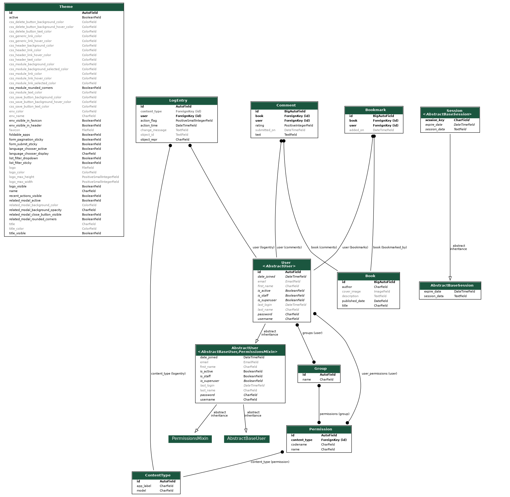

# Book Management API

This project is a Django-based API for managing books, allowing users to view book details, submit ratings and comments, and bookmark books. The project uses Docker for containerization.

## Getting Started

### Prerequisites

- Docker
- Docker Compose

### Running the Project

1. Clone the repository:

   ```bash
   git clone [<your-repo-url>](https://github.com/tmayt/books.git)
   cd books
   ```

2. Make .env file using setup_env script:
   > linux
   ```bash
   ./setup_env.sh
   ```
   > windows
   ```bash
   setup_env.bat
   ```
   
   after run follow the inputs

3. Build and start the application using Docker Compose:

   ```bash
   docker-compose build
   ```
   ```bash
   docker-compose up -d
   ```
> Note: You can see logs with `docker-compose logs -f`.

4. The application should now be running and accessible at `http://localhost`. You can configure the port in the Docker Compose file if needed.

### Accessing the Application

- **Swagger API Documentation**: [http://localhost/swagger/](http://localhost/swagger/)
- **Redoc API Documentation**: [http://localhost/redoc/](http://localhost/redoc/)
- **Admin Panel**: [http://localhost/admin/](http://localhost/admin/)
- **OpenAPI for Postman**: [http://localhost/redoc/?format=openapi](http://localhost/redoc/?format=openapi)
### Default Admin Credentials

- **Username**: `admin`
- **Password**: `admin`

### Entity Relationship Diagram (ERD)



### Stopping the Project

To stop the project, use the following command:

```bash
docker-compose down
```

## Additional Notes

- Ensure Docker is running and your ports are available.
- All migrations and dependencies are handled within the Docker setup.

Enjoy using the Book Management API!
